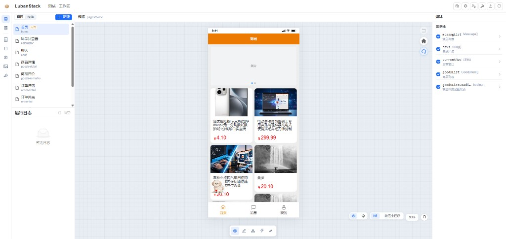
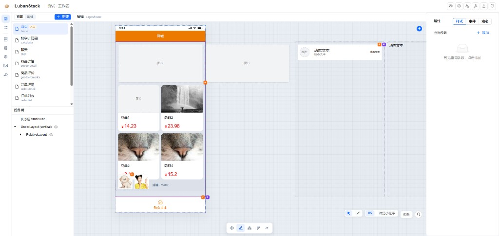
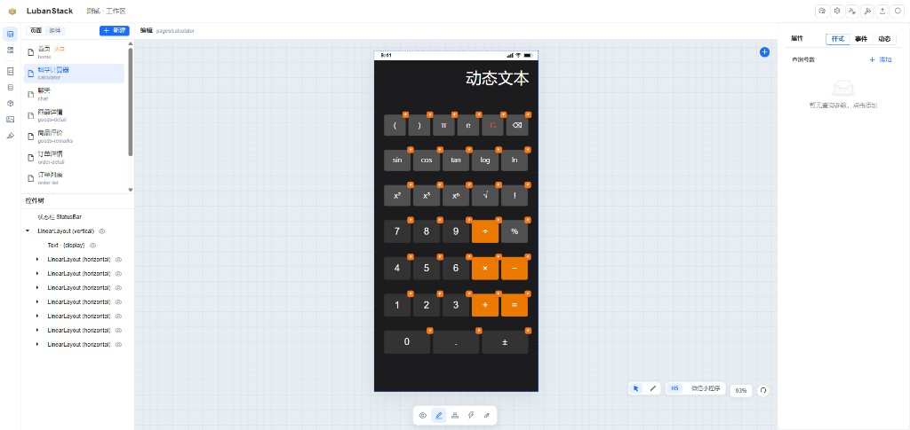
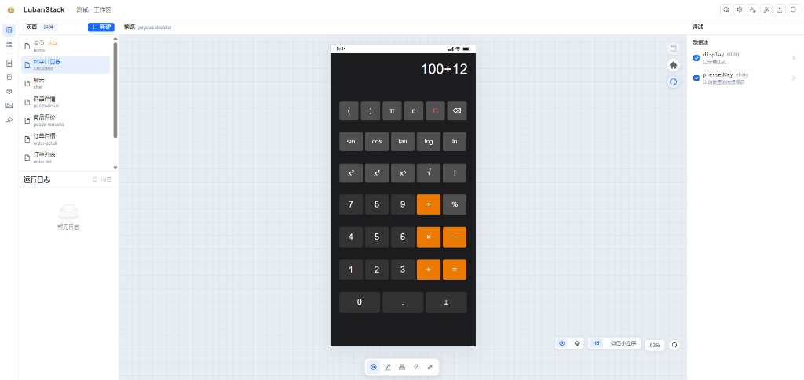
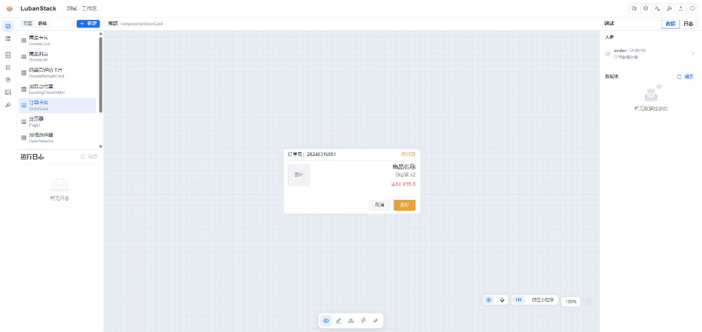
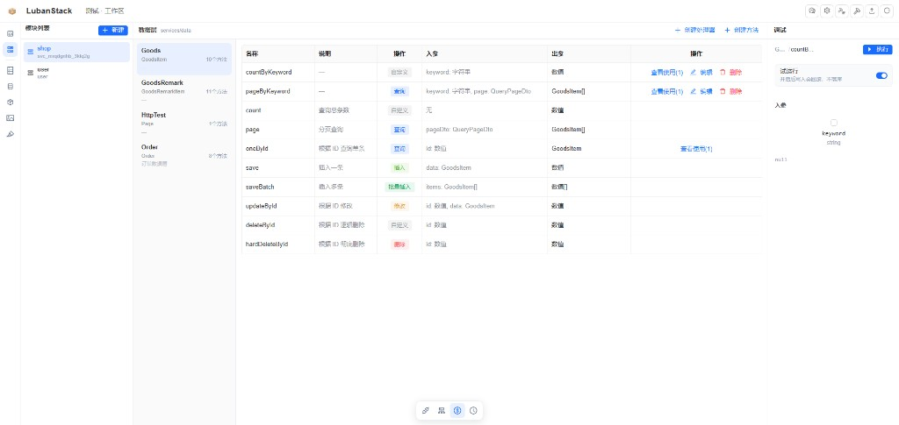
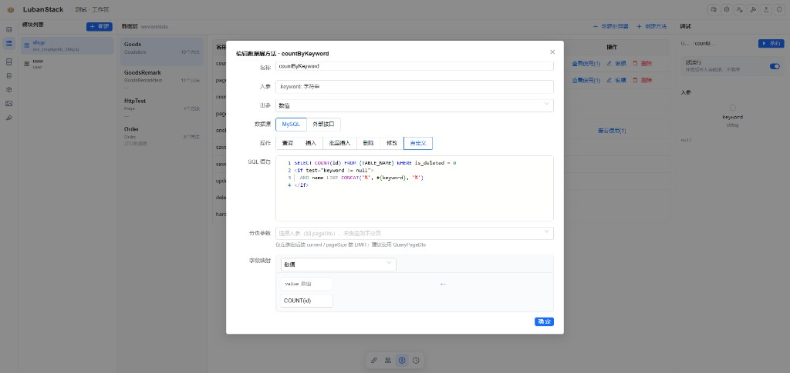
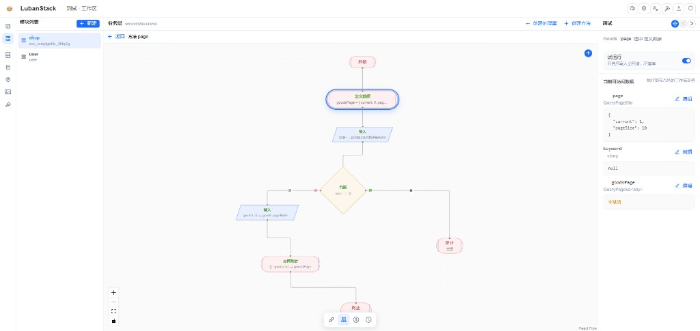
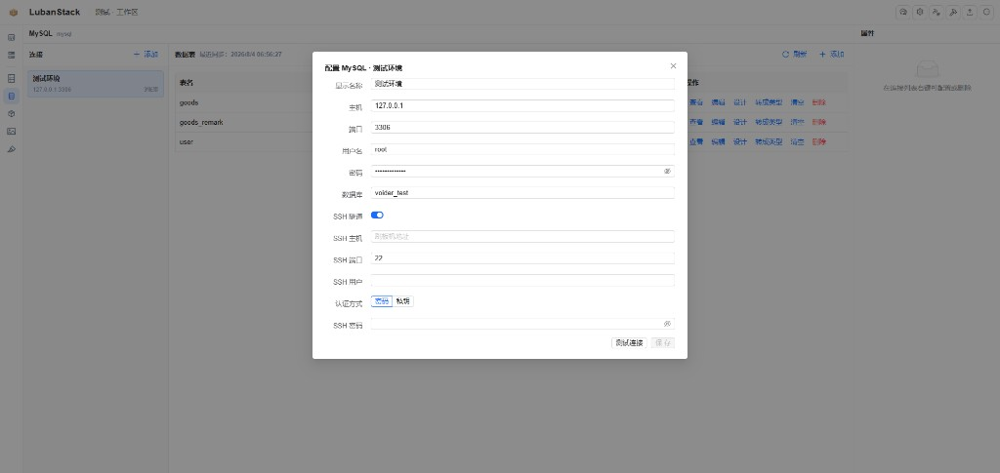
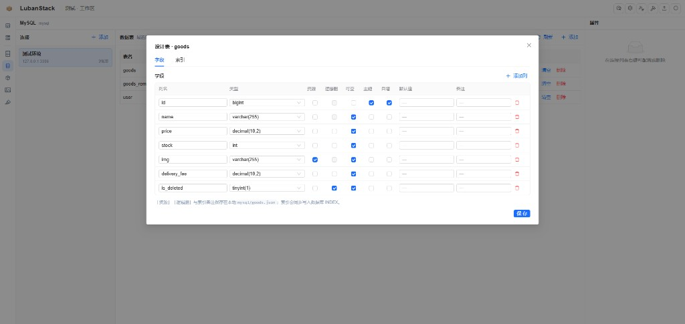

# LubanStack

面向 **H5 / 微信小程序** 的可视化低代码平台。用控件树画界面，用数据池管状态，用方法处理交互，用服务接后端；一个业务项目就是一个本地文件夹。

## 系统介绍

LubanStack 把「搭页面」和「写后端」放在同一个工作区里完成：

- **前端**：可视化编辑移动端界面，实时预览，数据绑定与事件编排。
- **后端**：声明式数据方法、动态 SQL、流程图式业务编排，并内置调试与试运行。
- **项目资源**：类型库、调色板、图标库、MySQL / 对象存储等，统一放在本地项目目录中版本管理。

适合快速搭建商城、工具页、业务中台类 H5 / 小程序应用；仓库内示例工程 `demos/mall` 已包含首页、商品、订单、计算器等页面与对应服务。

## 功能一览

### 可视化页面编辑

所见即所得地设计移动端界面：左侧管理页面与组件树，中间画布实时预览，右侧配置属性、样式、事件与动态绑定。支持 H5 与微信小程序双端预览。



*预览模式：运行当前页，右侧可查看数据源与调试信息。*



*编辑模式：点选控件改布局与样式，右侧切换「属性 / 样式 / 事件 / 动态」。*



*复杂布局同样用线性布局嵌套完成；组件树可精确选中每一行按键。*



*预览时直接操作界面，数据池字段（如 `display`）可在调试面板实时观察。*

### 数据驱动与多页管理

- **页面管理**：多页面并列维护（首页、聊天、商品详情、订单列表等）。
- **数据池**：普通字段、计算字段、接口字段、引用字段；界面属性绑定表达式读数据。
- **调试**：运行日志、数据源检查、试运行开关，编辑与验证同屏完成。

### 可复用业务组件

页面与组件分栏管理。卡片、列表、分页器、规格选择器等可独立编辑与预览；对外通过入参（属性）、事件、暴露方法与页面协作。



*组件模式：单独预览 `OrderCard`，右侧可配置入参（如 `order: OrderVo`）做调试。*

### 后端数据服务

按模块组织服务（如 shop、user），围绕实体声明数据方法：查询、插入、批量插入、修改、删除与自定义操作。入参 / 出参类型可视化配置，右侧可立即调试执行。



*数据源方法一览：名称、说明、操作类型、入参与出参一目了然。*



*支持 MySQL 与外部接口；自定义 SQL 可写动态标签（如 `<if>`），结果可映射到出参。*

### 可视化业务编排

业务层用流程图编排控制流：开始 / 终止、定义数据、调用数据方法、条件分支、映射返回等。调试面板可查看当前节点可访问变量，并支持试运行。



*业务方法可视化编排：串联分页查询、计数与结果映射。*

### MySQL 连接与表设计

项目资源里可配置多套 MySQL 环境（含 SSH 隧道），浏览表数据、设计表结构，并可将表转为类型模型供前端与服务使用。扩展元数据（如逻辑删除、隐藏列）可落在本地 JSON，与库结构协同管理。



*连接配置：主机 / 端口 / 库名，支持 SSH 隧道（密码或私钥），可先「测试连接」再保存。*



*可视化设计表字段：类型、主键、自增、可空、逻辑删除、隐藏等；保存后与数据库及本地元数据同步。*

### 核心能力汇总

| 能力 | 说明 |
| ---- | ---- |
| 可视化编辑 | 控件树 + 画布预览，H5 / 小程序场景切换 |
| 业务组件 | 独立编辑与预览，属性进 / 事件出，可复用 |
| 数据池与绑定 | 状态集中管理，属性绑定表达式，动态样式与显隐 |
| 方法与生命周期 | 点击 / 滚动 / 挂载等事件绑方法；支持流程或代码 |
| 数据层 | CRUD + 自定义 SQL / 外部接口，类型安全的入参出参 |
| 业务层 | 流程图编排，调用数据方法、分支、映射 |
| MySQL | 多环境连接、SSH 隧道、表设计、转为模型 |
| 调试 | 预览调试、数据检查、方法试运行 |
| 本地项目 | 以文件夹为项目单位，`luban.json` 为入口，便于 Git 协作 |

## 怎么理解它

**页面 / 组件 = 界面树 + 数据池 + 方法。**

- **界面**负责呈现与触发：控件属性可以写死，也可以绑定表达式读数据。
- **数据池**负责这一页（或这个组件）的状态：普通字段、计算字段、接口字段、引用字段。
- **方法**负责过程：改数据、跳转、调接口、弹提示。点击、滚动、生命周期都绑到方法上。
- **服务**负责远程与持久：HTTP 接口、业务编排、数据层；前端只声明「调谁、参数从哪来、结果放哪」。

四层职责分开，项目才好维护。

## 快速开始

需要同时跑后端（默认 `3000`）和前端（默认 `5173`）。桌面端会一并拉起。

### 桌面端（推荐）

```bash
cd server && npm install && cd ..
cd frontend && npm install && cd ..
cd desktop && npm install
npm run dev
```

会打开 Electron 窗口，并启动本地 API 与 Vite。

打包 Windows 安装包 / 便携包：

```bash
cd desktop
npm run build
```

产物在 `desktop/release/`。安装后由主进程托管前端静态资源与 `/api`，无需另开终端。

### 浏览器联调

```bash
# 终端 1
cd server && npm install && npm run dev

# 终端 2
cd frontend && npm install && npm run dev
```

浏览器打开 `http://localhost:5173`。前端会把 `/api` 代理到 `127.0.0.1:3000`。

## 第一次用

1. 欢迎页选择 **打开项目** 或 **新建项目**。
2. 打开时，所选文件夹必须已有合法的 `luban.json`；新建会写入该文件并创建空的 `pages/`。
3. 进入工作区后，先在项目设置里定 **入口页**、画布宽度（默认 375）、目标场景（H5 / 小程序）和接口基址。
4. 仓库内示例工程：`demos/mall`（商城：首页、商品、订单、组件与后端服务都已搭好）。

### 项目配置 luban.json

```json
{
  "name": "活动页",
  "version": "0.1.0",
  "author": "your-name",
  "engineVersion": "1.0.0",
  "canvas": {
    "width": 375,
    "scene": "h5"
  },
  "entryPage": "home",
  "apiBaseUrls": {
    "default": "http://127.0.0.1:3030"
  }
}
```

| 字段 | 说明 |
| ---- | ---- |
| `name` / `version` / `author` | 项目名称、版本、作者 |
| `engineVersion` | 引擎版本号 |
| `canvas.width` | 画布宽度（px），默认 `375` |
| `canvas.scene` | 画布场景：`h5` 或 `miniprogram` |
| `entryPage` | 启动页标识 |
| `apiBaseUrls` | 各模块接口基址；业务绑定只记服务与接口 id，不写死主机名 |

## 工作区怎么用

左侧活动栏分三块：

| 区域 | 做什么 |
| ---- | ---- |
| **前端** | 页面、组件的界面 / 数据 / 方法 / 生命周期 |
| **后端** | 服务模块：控制器、业务层、数据层、定时任务 |
| **项目资源** | 数据类型、MySQL、对象存储、图标库、调色板 |

打开某个页面或组件后，顶部分模式：

| 模式 | 做什么 |
| ---- | ---- |
| **预览** | 在画布上运行当前页/组件，可调调试面板看数据、入参、日志 |
| **编辑** | 点选控件改布局与样式；右侧可切「样式 / 事件 / 动态样式」 |
| **数据池** | 增删字段、绑接口、配计算与引用 |
| **方法** | 用流程或代码写交互逻辑，可暴露给父级调用 |
| **生命周期** | 挂载、更新、卸载时自动跑动作列表 |

选中控件后：文案、显隐、选中态尽量绑定数据；点击绑方法。不要在绑定表达式里做跳转、写库等副作用。

## 推荐搭建顺序

1. **立骨架**：入口页、画布与目标端、主题色与图标；需要时先建类型和后端模块。
2. **先通主路径**：线性布局搭结构 → 数据池建状态 → 关键字段绑到界面 → 点击跳下一页。通了再补空态、错误、加载中。
3. **重复块抽组件**：卡片、列表外壳、分页器、选择器下沉为组件。属性进、事件出；需要命令式操作再暴露方法。
4. **接数据**
   - 进页即显：数据池绑接口。
   - 用户触发或分页：方法里调「接口型属性」，或把 API 配进组件属性由组件去调。
   - 写入/副作用：走服务业务能力。
5. **打磨体验**：条件显隐、动态样式、滚动联动、状态栏与主题统一。复杂分支进方法和生命周期。
6. **导出前检查**：入口是否正确、接口基址是否指向目标环境、构建方案是否包含所需页面与服务。

## 界面怎么拼

界面是一棵控件树。默认用 **线性布局** 做主结构；底栏、角标、浮动按钮再用 **相对布局**。

| 控件 | 用途 |
| ---- | ---- |
| `Text` / `Button` / `Input` | 文案、操作、输入 |
| `Image` / `Icon` | 图片；图标引用项目 `icons.json`，不要在 XML 里嵌大段 SVG |
| `LinearLayout` | 横/竖依次排布；`overflow="scroll"` 可滚动 |
| `RelativeLayout` | 贴边、居中 |
| `Swiper` | 轮播 |
| `MultiWindow` | 同一区域按当前键只显示其中一个子窗口（适合 Tab） |
| `Modal` | 全屏弹层；数据池引用可 `.show()` / `.hide()` |
| `Component` | 嵌入已定义的业务组件，并填插槽 |

页面目录示例：

```
pages/
└── home/
    ├── config.json    # 名称、标题、入参等
    ├── index.xml      # 控件树
    ├── data.json      # 数据池
    ├── lifecycle.json # 可选
    └── function/      # 方法
```

交互属性用 `onClick` / `onLongClick` / `onTouchStart` 等（不要写 `click`）。值为动作列表：调方法、改某个数据字段、或一小段自定义语句，按顺序执行。

```json
[{"id":"bind_1","method":"clear","args":{}},{"id":"bind_2","method":"inputDigit","args":{"digit":"7"}}]
```

`args` 的键必须与方法入参名一致。

## 组件、数据、服务

**组件**没有独立路由。对外三张口：属性（父 → 子）、事件（子 → 父）、暴露方法（父主动调用）。导航和全局提示优先放页面，组件把意图抛上去。

**数据池字段**常见四种：普通（可写）、计算（只读推导）、接口（声明式拉数）、引用（指向树上某个节点以调用其方法或弹层）。能算出来的不要再存一份。

**接后端**三种常见接法：

1. 数据池字段绑定某个 API（适合进页自动加载）。
2. 把 API 配进组件的「可调用接口」属性，由组件方法在分页、搜索时调用。
3. 在服务编排里走业务/数据方法或网络节点。

前端不直接操作数据库，也不要在界面里拼 SQL。跨页面稳定的数据结构放进 **类型库**。颜色走 **调色板** 命名色，换品牌色改一处即可。

## 更细的用法

编辑器里怎么配、表达式能读什么、服务怎么绑，见 [docs/](./docs/README.md)：

| 文档 | 讲什么 |
| ---- | ---- |
| [项目结构](./docs/01-project-structure.md) | 一个项目由哪些部分组成 |
| [页面](./docs/02-pages.md) | 入口、入参、跳转 |
| [控件](./docs/03-xml-widgets.md) / [属性](./docs/04-xml-attributes.md) | 界面怎么拼、属性怎么挂 |
| [组件与插槽](./docs/05-components-and-slots.md) | 复用块、属性/事件/暴露方法 |
| [数据池](./docs/06-data-pool.md) / [绑定](./docs/07-bindings-and-expressions.md) | 状态从哪来、界面怎么读 |
| [方法与事件](./docs/08-methods-and-events.md) | 点击与生命周期 |
| [前端用服务](./docs/09-services-for-frontend.md) | 三种接接口的方式 |
| [类型库](./docs/10-types-library.md) / [主题与资源](./docs/11-theming-assets.md) | 结构约束、颜色图标、构建环境 |
| [搭建总览](./docs/12-usage-overview.md) | 推荐顺序（浓缩版） |

## 本仓库结构（开发工具本身）

```
voider/
├── frontend/          # 编辑器：React + TypeScript + Ant Design
├── server/            # 本地 API：Node.js + Express + TypeScript
├── desktop/           # Electron 桌面端（内嵌 server + frontend）
├── demos/mall/        # 示例业务项目
├── docs/              # 低代码用法说明
└── docs/screenshots/  # README 截图
```

生产环境通过 `LUBAN_STATIC_DIR` 由 Express 托管前端静态资源；开发态仍走 Vite，API 经 proxy 访问 `127.0.0.1:3000`。
